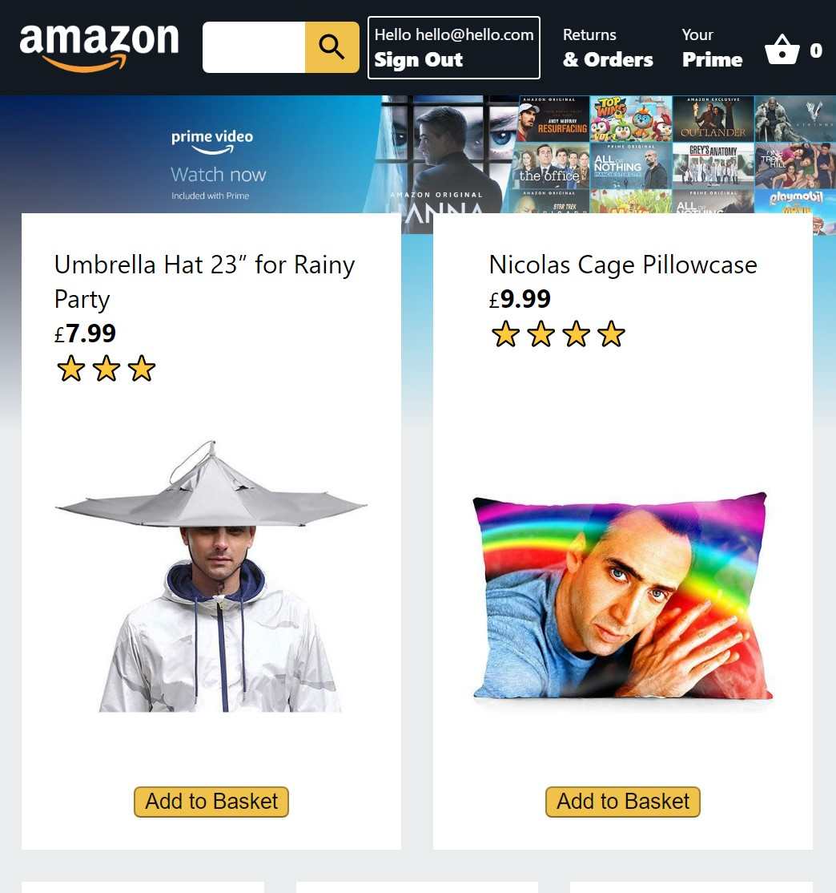
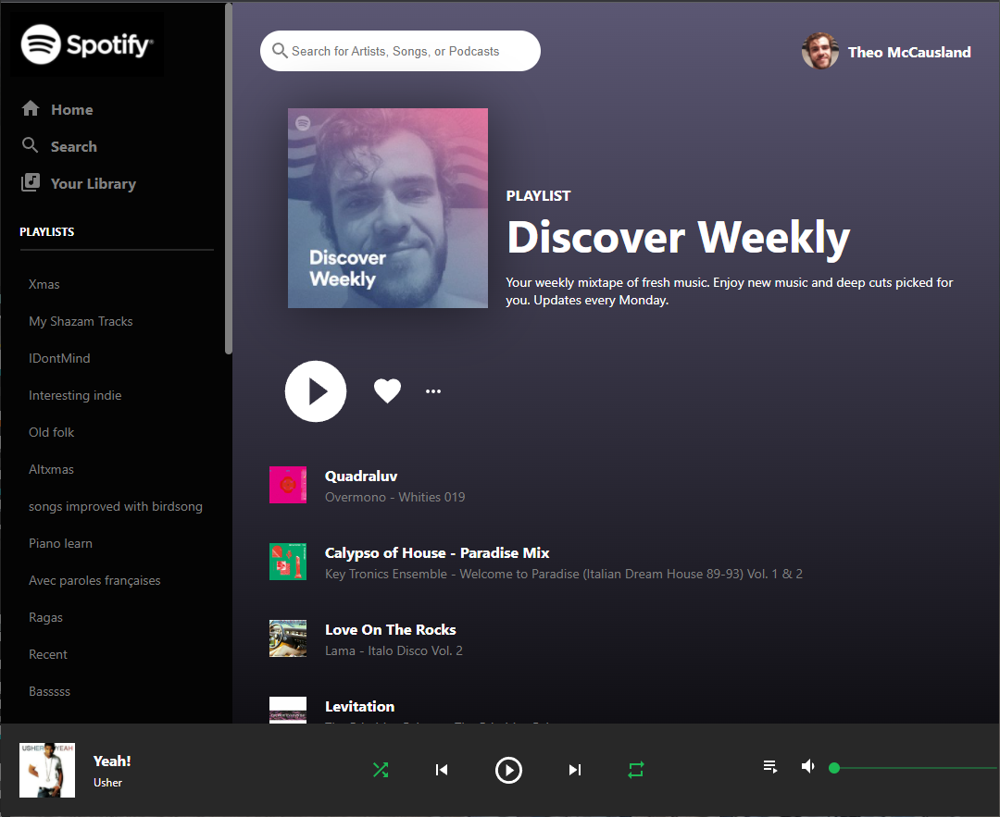

# 👋 Hi there, I'm Theo McCausland

### 🚀 Machine Learning Engineer | Data Engineer | Cloud Data Analyst | Full-Stack Web Developer | Technology Innovator

I am an experienced data professional with over 5 years in the technology industry, specialising in data-driven solutions, machine learning, and cloud computing. My expertise spans from developing innovative machine learning models to delivering impactful data analysis and visualisation for large-scale clients. With strong programming skills and certifications in cloud computing, I’m passionate about driving impactful solutions that empower businesses to thrive. I bring a mix of leadership, creativity, and analytical thinking to every project I work on.

---

### 🔥 Core Competencies:
- **Programming**: Python, SQL, JavaScript, Java, C++, Bash, PowerShell, React, Node.js
- **Data Science & Machine Learning**: Pandas, Numpy, Spacy, Scikit-learn, NLP, Matplotlib, Seaborn
- **Cloud Computing**: AWS (Certified), Azure (Certified)
- **Business Intelligence**: Power BI, Power Automate, DAX, Excel, Geospatial Visualisation
- **DevOps**: MLOps, Automation, Continuous Deployment
- **Web Development**: Full-stack (React, JavaScript, Node.js, Firebase), Firebase Authentication, API Design
- **Hardware**: Building PCs, Raspberry Pi Tinkering, Repairing Phones

---

### 🏆 Key Achievements:
- **Data Model Innovation**: Reduced RAM load of a Power BI dashboard from 1GB to just 50MB using advanced data modeling techniques.
- **Cloud Solutions**: Delivered cloud-based data analysis and visualisation solutions on AWS and Azure, improving decision-making processes for public sector clients.
- **Machine Learning & AI**: Developed and deployed machine learning models, including natural language processing (NLP) systems to extract actionable insights from unstructured data.
- **Power BI Dashboards**: Delivered advanced Power BI dashboards for healthcare and public sector clients, transforming raw data into actionable insights, enhancing decision-making processes.
- **Automation Expertise**: Developed cross-platform automation workflows, improving operational efficiency by over 30%.
- **Leadership in Training & Documentation**: Delivered workshops, wrote technical documentation, and developed training courses on data analytics and automation tools, helping teams upskill and adopt cutting-edge technologies.

---

### 📊 GitHub Stats:

---

### 🎓 Bootcamp Experience:

### **🌐 Cloud Engineering - Amazon Web Services re/Start Skills Bootcamp**  
*Skills City | 2024 | 12 Weeks*

I completed the **AWS re/Start** Skills Bootcamp, which focused on hands-on learning in AWS cloud services, networking, cybersecurity, and scripting with Python. I earned multiple certifications and completed extra credit in **MLOps**.

**Certifications:**
- AWS Certified Cloud Practitioner
- CompTIA Security+

**Notable Project:**
- **MLOps on AWS (In Progress)**: Deploying machine learning models on AWS infrastructure to automate model management and improve scalability.

---

### **📊 Data Science with Python - CoGrammar Skills Bootcamp**  
*CoGrammar | 2024 | 12 Weeks*

This bootcamp focused on advanced Python programming, machine learning, and data analysis. I completed two capstone projects that showcased my ability to work with large datasets, natural language processing (NLP), and financial analysis tools.

**Key Achievements:**
- Scored **100%** on all assignments and assessments.
- Developed **Python** solutions with rich documentation and professional-level code quality.

**Capstone Projects:**
1. **Finance Calculator**:  
   Built a finance calculator to automate financial computations using Python.  
   - Tools: Python, Rich, Pandas  
   - [GitHub Code](https://github.com/theotheories/DataScienceCourseSolutions/blob/main/capstone_finance_calculators.py)

2. **NLP Sentiment Analysis**:  
   Designed a natural language processing project that analysed customer sentiment.  
   - Tools: Spacy, TextBlob, Python  
   - [GitHub Code](https://github.com/theotheories/DataScienceCourseSolutions/blob/main/capstone_NLP_sentiment_analysis.py)

---

### **📊 Data Analyst Bootcamp**  
*Firebrand Training | 2022 | Online | 12 Weeks*

This bootcamp offered training on data analysis, data visualisation, and GDPR compliance, focusing on real-world applications using Microsoft Azure and Excel. I passed all exams on the first attempt with high scores across the board.

**Certifications:**
- Microsoft Azure Fundamentals
- BCS Data Analysis Concepts (92-100% scores)
- Microsoft Data Analysis and Visualisation with Excel

---

### 🎖 Certifications & Awards:

#### **Cloud Computing Certifications:**
- AWS Certified Cloud Practitioner
- Microsoft Azure Fundamentals
- CompTIA Security+

#### **Data Analysis & BI Certifications:**
- PL-300 Power BI Data Analyst Associate
- Microsoft Data Analysis and Visualisation with Excel
- BCS Data Analysis Concepts
- AI-900 Azure AI Fundamentals
- DP-900 Azure Data Fundamentals

#### **Additional Certifications:**
- Ethical Hacking - Programming Hub
- C++ - Google Developers Launchpad
- Java - SoloLearn
- Web Development - Mimo
- DELE Spanish C1 (85% scored)
- Dale Carnegie Effective Communication and Human Relations
- Cardiac First Aid Instructor (British Heart Foundation)

---

### 💼 Professional Experience:

#### **Analytics Consultant | Agilisys**  
*2023 – Present, London, UK*  
- Delivered data-driven solutions and automation for public sector clients such as NHS Trusts and museums.
- Developed advanced Power BI dashboards for critical healthcare metrics and social housing data, streamlining data models for improved decision-making.
- Created automation workflows to reduce manual tasks, improving overall efficiency by 30%.

#### **Junior Data Analyst | Agilisys**  
*2022 – 2023, London, UK*  
- Optimised Power BI dashboards, reducing processing times and improving insights delivery for public sector clients.
- Conducted in-depth data analysis using Power BI, SQL, and Excel to drive key decision-making for clients.

#### **Web & App Developer | Freelance**  
*2020 – 2022*  
- Built full-stack web and mobile applications using React Native, Firebase, and MongoDB.
- Designed custom extensions and features to promote local businesses.

---

### 🛠 Tech Stack:
      

---

### 🌱 Ongoing Development:
- **Machine Learning**: Focus on advanced machine learning algorithms and AI model deployment.
- **Large Language Models**: Exploring applications of LLMs in natural language processing.
- **AI Ethics**: Continuing to learn about responsible AI development.

---

### 💻 Web App Design Projects:

| Project | Description |
|---------|-------------|
| **[Amazon Style eCommerce Website](https://clone-1801d.web.app/)**    | A fully functional e-commerce website built with **React.js**, **Stripe**, and **Firebase** for full-stack operations. |
| **[API and Frontend - Spotify Style](https://theospotifyclone.web.app/)**    | Built a Spotify clone using **React.js**, **Spotify API**, and **Firebase**. Features real-time playlist display and slick UI. |

---

### 📫 Let's Connect:
- **GitHub**: [GitHub](https://github.com/theotheories)
- **LinkedIn**: [LinkedIn](https://linkedin.com/in/theo-mccausland)

---

### 🎖 Additional Achievements:
- **Presentation Skills**: Delivered high-quality training sessions and workshops for clients and colleagues.
- **Client Relations**: Received glowing feedback for building positive relationships and clear communication with clients.
- **Leadership**: Led workshops and handled client projects autonomously, demonstrating technical expertise and strategic thinking.

---

### 💡 Fun Facts:
- I speak **fluent Spanish**, basic **French**, and a few words of **Azerbaijani**.
- I’ve lived in **three different countries**: UK, Spain, and Azerbaijan.
- Outside of work, I enjoy **acting**, **quizzes**, and **long-distance running and cycling**.
- I’m a **baritone singer**, performing with choirs that have toured across the UK.

---

