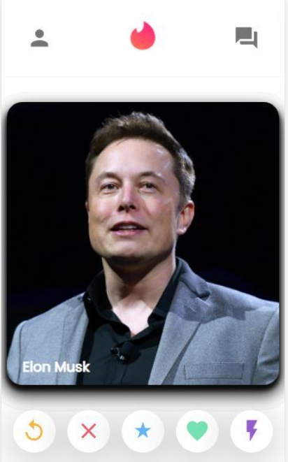

# 👋 Hi there, I'm Theo McCausland

### 🚀 Aspiring Machine Learning Engineer | Data Engineer | Experienced Cloud Data Analyst | Skilled in Web and App Dev

I am a passionate and versatile data professional with over 5 years of experience in the technology industry, specialising in data-driven solutions, machine learning, and cloud computing. My background includes leading cross-functional teams, developing innovative machine learning models, and streamlining data operations to deliver high-impact results. I'm seeking to drive innovation and make a positive impact in fast-paced, challenging environments.

### 🔥 Core Competencies:
- **Programming**: Python, SQL, JavaScript, Java, C++, Bash, PowerShell
- **Data Science, Machine Learning**: Pandas, Numpy, Spacy, Scikit-learn, Matplotlib, Seaborn
- **Cloud Computing**: AWS, Azure
- **Business Intelligence**: Power BI, Power Automate, DAX, Excel
- **DevOps**: Automation, Data Pipelines, MLOps
- **Hardware**: Building PCs, Repairing Phones, Raspberry Pi tinkering

### 🏆 Key Achievements:
- Innovated a data modelling technique, reducing RAM load of a dashboard from 1GB to just 50MB.
- Led and delivered critical Power BI dashboards, data model optimisation, and writing SQL for clients like V&A Museum, Leeds NHS Trusts, North Lanarkshire Council.

---

### 📊 GitHub Stats:

---

### 🎓 Bootcamp Experience:

#### **Cloud Engineering - Amazon Web Services re/Start Skills Bootcamp**  
*Delivered by Skills City | 2024 | 12 Weeks*

I completed the **AWS re/Start** Skills Bootcamp, which provided a comprehensive foundation in cloud computing, networking, and cybersecurity, culminating in hands-on experience with AWS and related technologies. I successfully passed multiple certification exams and took on extra credit work in **MLOps** and **Cybersecurity**.

**Key Skills and Technologies:**
- **Cloud Computing**: AWS (Amazon Web Services)
- **Linux**: Foundations in system administration
- **Networking**: Basic and advanced networking concepts
- **Cyber Security**: Introduction to security practices and protocols
- **Python Programming**: Scripting and automation
- **Databases**: Introduction to database management
- **AWS Jumpstart and Advanced AWS**: Hands-on labs and projects using AWS services

**Certifications:**
- AWS re/Start
- AWS Certified Cloud Practitioner
- CompTIA Security+

**Notable Project:**
- **MLOps Project (In Progress)**: Working on an MLOps project as extra credit with my lecturer, which involves deploying machine learning models using AWS infrastructure.

#### **Data Science Skills Bootcamp - CoGrammar**  
*Delivered by CoGrammar | 2024 | 12 Weeks*

I completed the **Data Science Skills Bootcamp** with a focus on mastering Python programming, machine learning, and data analysis. Throughout the bootcamp, I achieved an average score of **100%** on all submissions, demonstrating excellence in both theoretical understanding and practical implementation. My work included two major capstone projects, showcasing my expertise in data science and natural language processing (NLP). 

**Portfolio and GitHub:**
- [Portfolio with Marks and Feedback](https://www.hyperiondev.com/portfolio/TM23120011178/)
- [GitHub Repo for Solutions](https://github.com/theotheories/DataScienceCourseSolutions)

**Key Skills and Technologies:**
- **Programming**: Python, Numpy, Pandas, Seaborn, Spacy, TextBlob, ReportLab, Rich
- **Data Science**: Data analytics, data exploration, visualisation with Seaborn
- **Machine Learning**: Supervised machine learning, NLP (Natural Language Processing)
- **Libraries Used**: Numpy, Pandas, Spacy, Seaborn, ReportLab, TextBlob, Rich, Multiprocessing, and more
- **Version Control**: Git

**Capstone Projects:**
1. **Finance Calculator**:  
   A Python-based finance calculator that performs various financial computations. The project features clean code with docstrings, comments, and beautiful console output generated using the **Rich** library.
   - Tools: Rich, Math, OS, Webbrowser
   - [View Code on GitHub](https://github.com/theotheories/DataScienceCourseSolutions/blob/main/capstone_finance_calculators.py)
   - 

2. **NLP Project**:  
   A natural language processing project aimed at extracting insights such as customer sentiment from textual data. The project used libraries such as **Spacy** and **TextBlob**.
   - Tools: Python, Spacy, TextBlob, ReportLab
   - [View Code on GitHub](https://github.com/theotheories/DataScienceCourseSolutions/blob/main/capstone_NLP_sentiment_analysis.py)

**Achievements:**
- Scored **100%** across all tasks, projects, and assessments.
- Wrote high-quality Python code with clear docstrings and comments.
- Gained deeper understanding of **Machine Learning methods**. 

**Notable Libraries Used**:
- **Numpy**, **Pandas**: For data manipulation and analysis
- **Spacy**, **TextBlob**: For natural language processing
- **Seaborn**: For data visualisation
- **ReportLab**: For generating PDF reports
- **Rich**: For enhancing console output
- **Multiprocessing**: For improving performance with parallel processing

---

### 💼 Professional Experience:

#### **Analytics Consultant | Agilisys**  
*2023, London, UK*  
- Spearheaded the development of data-driven solutions to optimise operations and enhance customer satisfaction.
- Created cloud-based pipelines on AWS and Azure to monitor and maintain data quality and integrity.

#### **Junior Data Analyst | Agilisys**  
*2022 – 2023, London, UK*  
- Led dashboard development for public sector clients, including critical healthcare metrics for NHS Trusts.
- Implemented data modelling improvements that optimised system performance and reduced processing time.

#### **Web & App Developer | Freelance**  
*2020 – 2022*  
- Developed web applications and mobile apps using JavaScript, React Native, Firebase, and HTML.
- Delivered custom web extensions and creative projects to promote local businesses and services.

#### **Software Developer | Diegesis/Cysure**  
*2020, London, UK*  
- Debugged and developed hardware-interfacing software used in emergency and military services.
- Created innovative tools for file transfer testing in high-latency, patchy network environments.
- Used Java, Ubuntu, Raspbian, C++, Raspberry Pi, Windows, Terminal, Bash

---

### 🎓 Education:
**MA Natural Sciences (Major: Neuroscience, Minor: Business) | University of Cambridge**  
*2015, 2:1*

**Tech Certifications:**
- CompTIA Security+
- AWS Cloud Practitioner
- PL-300 Power BI Associate
- AI-900 Azure AI Fundamentals
- AZ-900 Azure Cloud Fundamentals
- PL-900 Power Platform Fundamentals
- DP-900 Azure Data Fundamentals
- BCS Data Analysis Concepts

---

### 🛠 Tech Stack:
      

---

### 🌱 What I'm Learning:
- Deepening my skills in **Machine Learning** and **Natural Language Processing**.
- Exploring **LLMs (Large Language Models)**, advanced data engineering techniques, and **AI ethics**.

---

### 💡 Fun Facts:
- I speak **fluent Spanish**, **basic French**, and a few words in **Azerbaijani**.
- Outside of work, I enjoy **acting** and tackling extreme sports like **long-distance running and cycling**.
- I'm a baritone singer, **performing in choirs that have toured across the UK**.

---

### 📫 Let's Connect:
- **GitHub**: [GitHub](https://github.com/theotheories)
- **LinkedIn**: [LinkedIn](https://linkedin.com/in/theo-mccausland)
- **Portfolio**: [Portfolio](https://dazzling-poincare-62d648.netlify.app/)
- **CodeWars**: [CodeWars](https://www.codewars.com/users/theotheories)

---

### 🎖 Certifications & Awards:
- DELE Spanish C1 (85% scored) - full business competency
- Dale Carnegie Effective Communication and Human Relations - communication skills and leadership
- Scuba Diving
- Driving Licence

---

### ⚡ Recent Projects:
- **SavviVille App**: Developed a mobile app to promote local jobs and businesses using React Native and Firebase.
- **Healthcare, Housing, and Ticketing Dashboards**: Designed Power BI dashboards for public sector to track real-time citizen data, significantly improving operational efficiency.
- **Automation for tracking Cloud Assets and Teambuilding**: Built automation workflows in Power Automate to streamline internal processes and reduce human error.

---

### 💻 Web App Design Projects:

| Project | Description |
|---------|-------------|
| **[e-Commerce website - Amazon Style Full Stack](https://clone-1801d.web.app/)**    | A fully functional e-commerce clone using **React.js**, **Stripe** for credit card payment processing, **Firebase Authentication**, **Database**, **Functions**, and **Hosting**. The app includes real-time database management for order history, and is built with **Axios**, **HTML**, **CSS**, and **React Context API**. |
| **Tinder Style**    | A Tinder-style app with **MongoDB** using **Mongoose** for the backend, **Node.js** and **Express.js** for server-side logic, and hosted on **Heroku**. The frontend is built using **React.js** and hosted on **Firebase**. |
| **[API and Frontend - Spotify Style](https://theospotifyclone.web.app/)**    | Display your own Discover Weekly playlist with this Spotify Clone. Built with **React.js**, **React Context API**, **Spotify user authentication**, and **Spotify API**. The design incorporates **Flexbox CSS** and **Material UI** for a slick, responsive UI. |

---

